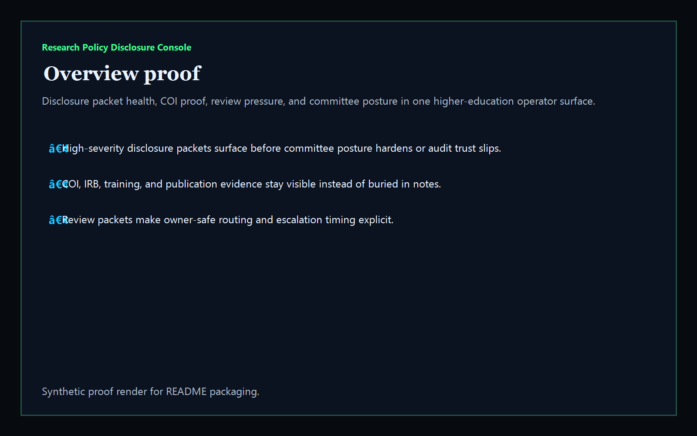
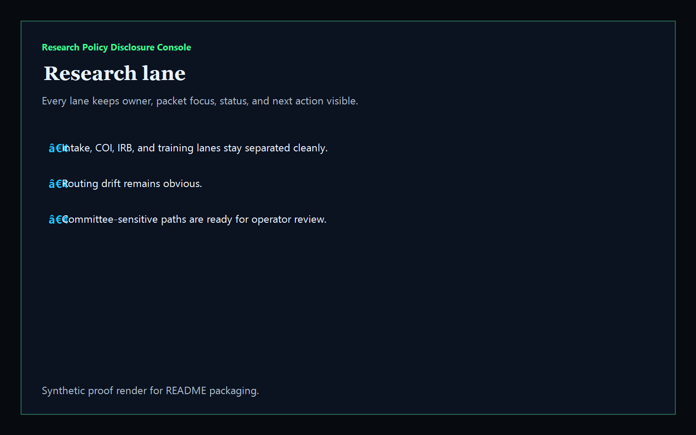
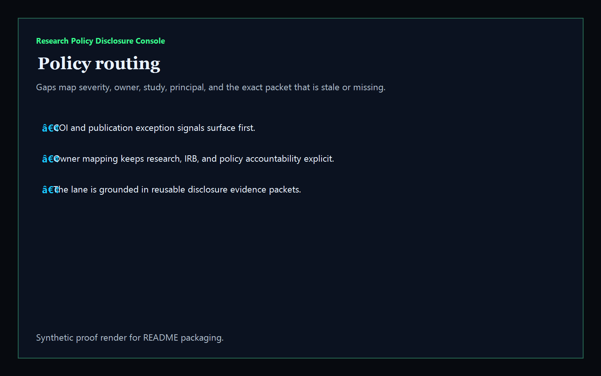
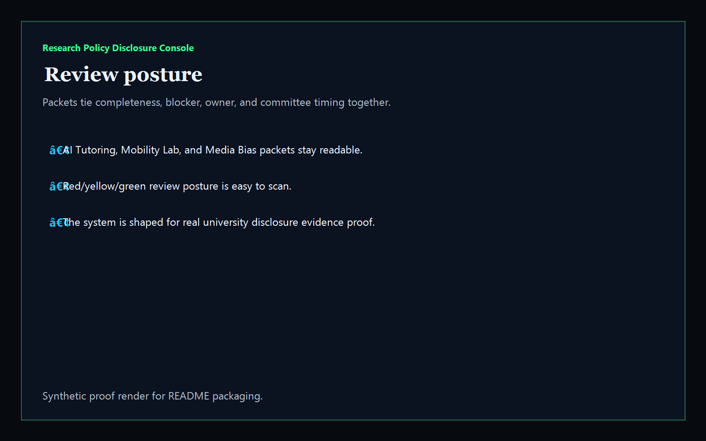

# Research Policy Disclosure Console

[](https://github.com/mizcausevic-dev/research-policy-disclosure-console/actions/workflows/ci.yml)
[](./LICENSE)
[](./.github/dependabot.yml)
[](https://github.com/mizcausevic-dev/research-policy-disclosure-console/actions/workflows/pages.yml)

TypeScript control plane for research disclosures, missing policy packets, committee pressure, and review-safe routing across higher-education operations.

## Why this exists

- Universities lose time when COI appendices, IRB acknowledgments, training proof, and publication exceptions live in separate systems.
- Governance issues often harden into audit or committee pain because routing fails and disclosure packets stay incomplete.
- Research compliance, sponsored programs, IRB administration, and policy teams all need the same disclosure picture without waiting on another spreadsheet.
- Higher Education buyers care whether the disclosure workflow is auditable and recoverable, not whether the dashboard looks “AI-powered.”

## Why this matters (KG Embedded tie-back)

This repo demonstrates the evidence-routing primitive for Higher Education / University Ops buyers: research disclosures tied to missing proof, stale packets, committee blockers, and owner-safe escalation paths. A B2B SaaS buyer would care because research-policy routing and committee readiness often need to surface inside customer-facing operator tools without exposing unsafe campus systems or write-heavy backends. Kinetic Gain Embedded extends this into security-first in-product analytics for review-aware and evidence-aware reporting across university compliance operations, see [kineticgain.com/embedded](https://kineticgain.com/embedded).

## Routes

- `/`
- `/research-lane`
- `/policy-routing`
- `/review-posture`
- `/verification`
- `/docs`

## API

- `/api/dashboard/summary`
- `/api/research-lane`
- `/api/policy-routing`
- `/api/review-posture`
- `/api/verification`
- `/api/sample`

## Screenshots






## Local Development

```powershell
cd research-policy-disclosure-console
npm install
npm run dev
```

Open:
- [http://127.0.0.1:5524/](http://127.0.0.1:5524/)
- [http://127.0.0.1:5524/research-lane](http://127.0.0.1:5524/research-lane)
- [http://127.0.0.1:5524/policy-routing](http://127.0.0.1:5524/policy-routing)
- [http://127.0.0.1:5524/review-posture](http://127.0.0.1:5524/review-posture)
- [http://127.0.0.1:5524/verification](http://127.0.0.1:5524/verification)

## Validation

- `npm run build`
- `npm run test`
- `npm run demo`
- `npm run smoke`
- `npm run render:assets`

## Production status

| Aspect | Status |
|--------|--------|
| CI | Node 20 + 22 matrix — lint · typecheck · coverage · build · demo · smoke · `npm audit` ([workflow](./.github/workflows/ci.yml)) |
| Test coverage | `src/services/` coverage gate maintained via `vitest` |
| License | [AGPL-3.0-or-later](./LICENSE) |
| Dependencies | Dependabot weekly (npm + GitHub Actions); `npm audit --audit-level=high` in CI |
| Data handling | Synthetic, non-student, non-faculty-identifying research packets only. No live sponsor or campus records. |
| Deploy | Static prerender → **https://research.kineticgain.com/** (GitHub Pages, [pages workflow](./.github/workflows/pages.yml)) |

## Docs

- [Kinetic Gain Embedded tie-back](./docs/KINETIC_GAIN_EMBEDDED.md)
- [Changelog](./CHANGELOG.md)

## Part of the Kinetic Gain Suite

Operator surface in the [Kinetic Gain Suite](https://suite.kineticgain.com/) — a portfolio of buyer-readable control planes spanning security posture, compliance evidence, data-platform governance, FinOps, and operator workflows. Apex: [kineticgain.com](https://kineticgain.com/).

## Related surfaces

- [**`student-ai-disclosure-landing`**](https://github.com/mizcausevic-dev/student-ai-disclosure-landing) — disclosure framing for education buyers
- [**`regulatory-reporting-mart`**](https://github.com/mizcausevic-dev/regulatory-reporting-mart) — reporting and deadline operations
- [**`trial-protocol-deviation-monitor`**](https://github.com/mizcausevic-dev/trial-protocol-deviation-monitor) — life sciences evidence and review posture
